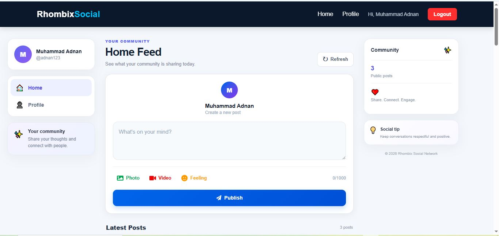
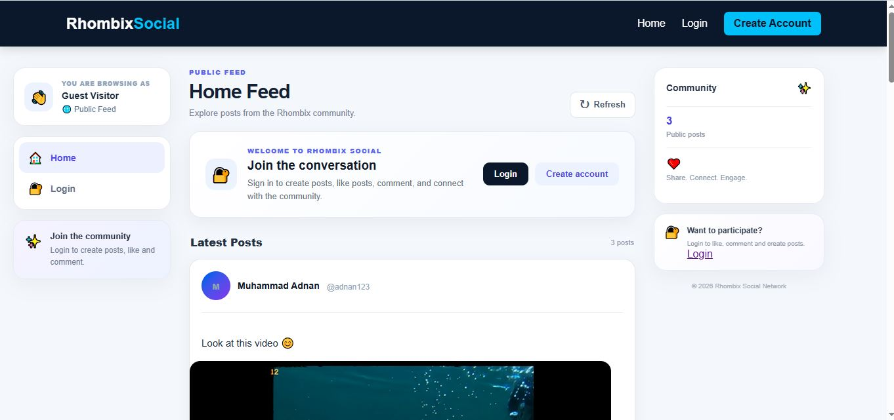
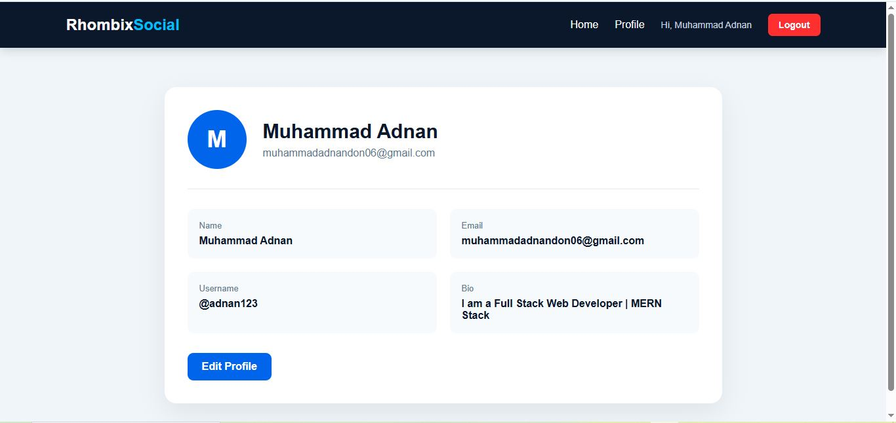
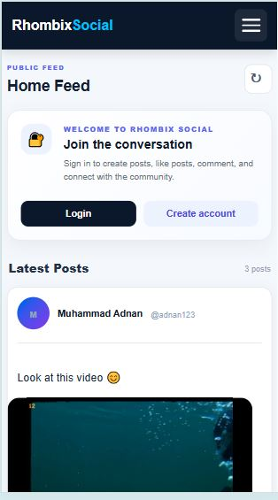

# Rhombix Social Network

A full-stack social networking web application developed as part of the **Rhombix Technologies Web Development Internship Program**.

The application provides user authentication, registration, login, social feed access, profile management, responsive navigation, validation, notifications, and MongoDB database integration.

---

## 📌 Internship Task

**Organization:** Rhombix Technologies  
**Program:** Web Development Internship  
**Project:** Social Network Web Application  
**Developer:** Muhammad Adnan

---

## 🚀 Project Overview

Rhombix Social Network is a full-stack web application built with a MERN-oriented technology stack.

The project demonstrates the implementation of a modern social networking application with authentication, user management, responsive design, and REST API communication.

### Main Objectives

- User registration
- User authentication
- Secure password hashing
- JWT-based authentication
- Social feed
- User profile
- Responsive navigation
- Mobile burger menu
- Login and registration validation
- Success and error notifications
- Logout functionality
- MongoDB database integration
- REST API communication

---

## ✨ Features

### 🔐 Authentication

- User registration
- User login
- JWT authentication
- Secure password hashing using bcryptjs
- Logout functionality
- Protected user functionality
- Gmail-based email validation
- Strong password validation
- Confirm password validation
- Username validation
- Terms & Conditions acceptance
- Privacy Policy acceptance
- Authentication success notifications
- Authentication error notifications

---

### 👤 User Profile

- View user profile
- Display user's full name
- Display username
- Display email
- Profile information management
- Profile picture support
- Bio support

---

### 📰 Social Feed

- Feed page
- Authenticated user experience
- Post-oriented social network structure
- Post content support
- Image and video media support
- Like functionality structure
- Comment functionality structure

---

### 📱 Responsive Design

The application is designed to work across:

- Desktop
- Laptop
- Tablet
- Mobile devices

On smaller screens, the desktop navigation is replaced with a responsive burger menu.

### Mobile Navigation

The mobile menu provides access to:

- Home
- Profile
- User information
- Logout

The burger menu automatically closes when a navigation item is selected.

---

### 🔔 Notifications

The application provides user-friendly notifications for:

- Login success
- Registration success
- Authentication errors
- Validation errors
- Server/API errors

Successful login and registration notifications are displayed before redirecting the user to the feed page.

---

## 🛠️ Technologies Used

### Frontend

- React.js
- React Router DOM
- JavaScript ES6+
- HTML5
- CSS3
- Vite

### Backend

- Node.js
- Express.js
- REST API
- JSON Web Token (JWT)
- bcryptjs

### Database

- MongoDB
- Mongoose

### Development Tools

- Visual Studio Code
- Git
- GitHub
- npm
- Postman

---

## 📂 Project Structure

```text
rhombixtechnologies_tasks/
│
├── frontend/
│   ├── public/
│   │   └── screenshots/
│   │       ├── feed.JPG
│   │       ├── feedlogin.JPG
│   │       ├── Profile.JPG
│   │       └── Mobile.JPG
│   │
│   ├── src/
│   │   ├── components/
│   │   ├── context/
│   │   ├── pages/
│   │   ├── services/
│   │   ├── App.jsx
│   │   └── main.jsx
│   │
│   ├── package.json
│   └── vite.config.js
│
├── backend/
│   ├── controllers/
│   ├── models/
│   │   ├── User.js
│   │   └── Post.js
│   │
│   ├── routes/
│   ├── middleware/
│   ├── config/
│   ├── server.js
│   ├── package.json
│   └── .env.example
│
├── .gitignore
└── README.md

# 👨‍💻 Developer

**Muhammad Adnan**

**Full Stack Web Developer**

### GitHub

[https://github.com/AdnanRaj01](https://github.com/AdnanRaj01)

### LinkedIn

[https://www.linkedin.com/in/Muhammad-Adnan-A0a1AA2b1/](https://www.linkedin.com/in/Muhammad-Adnan-A0a1AA2b1/)

---

# 📄 License

This project was developed for educational and internship purposes as part of the **Rhombix Technologies Internship Program**.

---

# ⭐ Support

If you like this project, consider giving the repository a ⭐ on GitHub.

# 📸 Project Preview

## 🏠 Home Page



---

## 🔐 Feed Login Page



---

## 👤 Profile Page



---

## 📱 Mobile View

